# Project 3: 'Voiture App'
Project completed by Noor Mahdi, Marwa AlKhashram, Sara Husain.

# Description: Voiture - Car Exhibition App
Voiture is a Car Exhibition application made to showcase numerous companies' exhibition events. The application allows the user to constantly be updated on car exhibitions in Bahrain. The application allows users to change their user type by the approval of the Admin and own their personal exhibition and the capability to modify the details.

## Wireframes
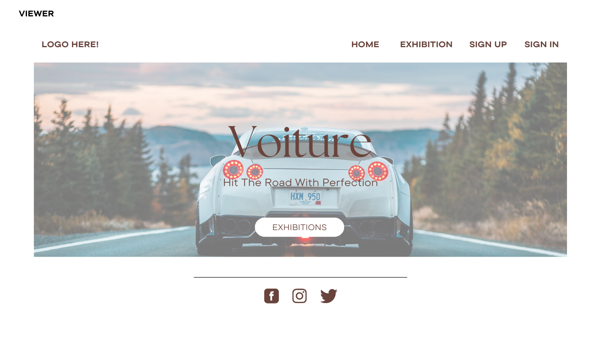 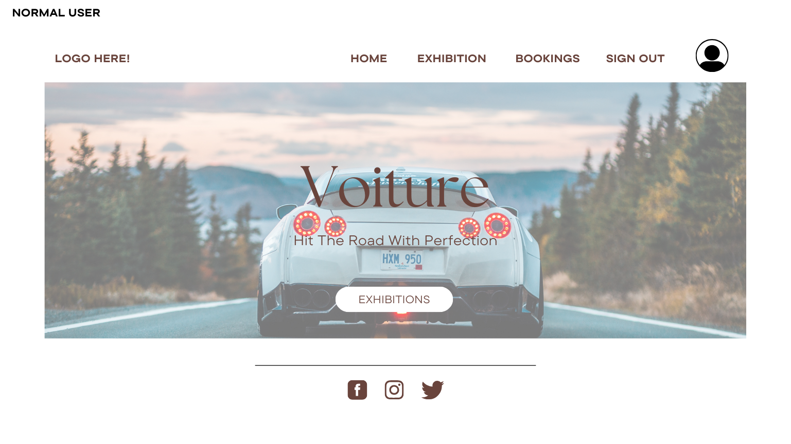  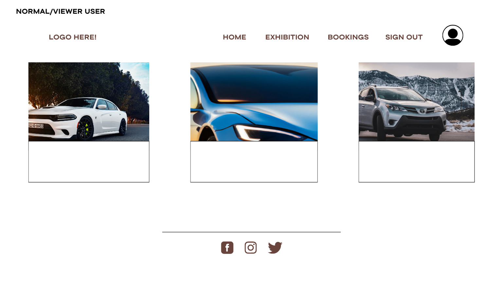 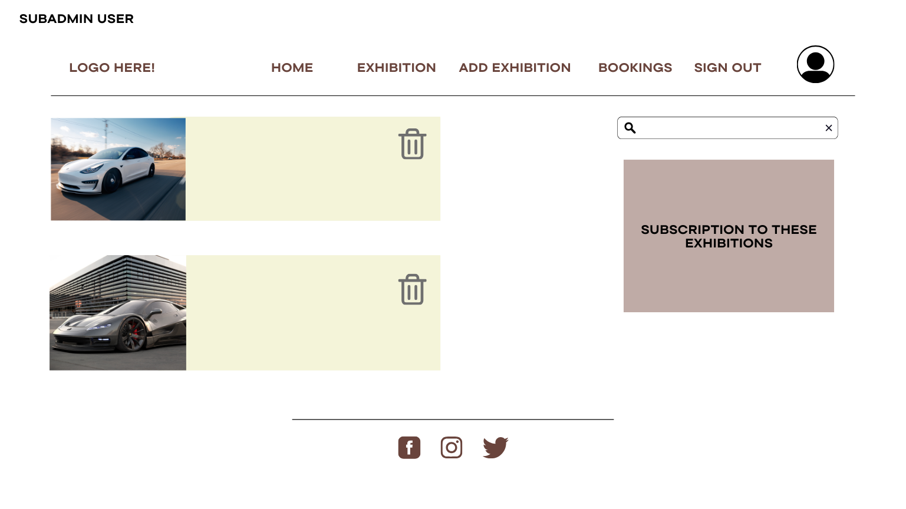 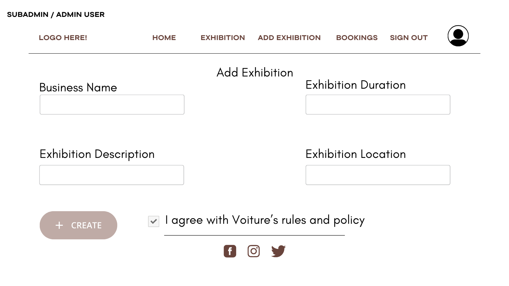 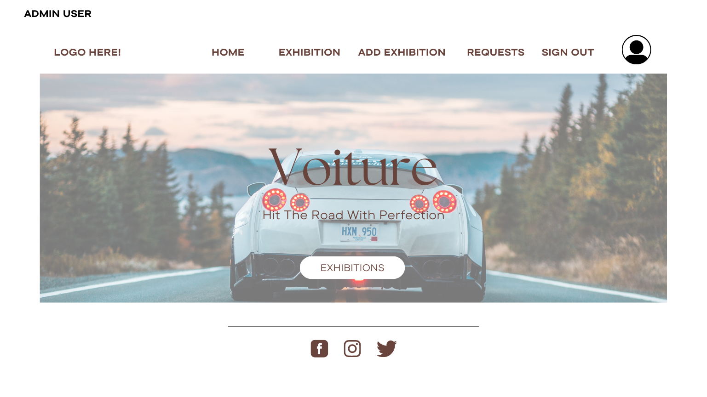 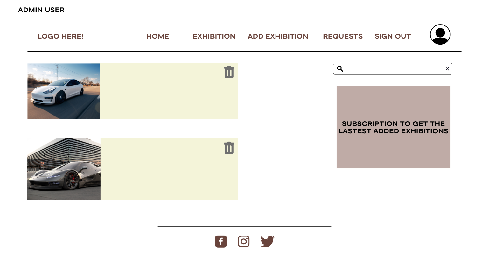 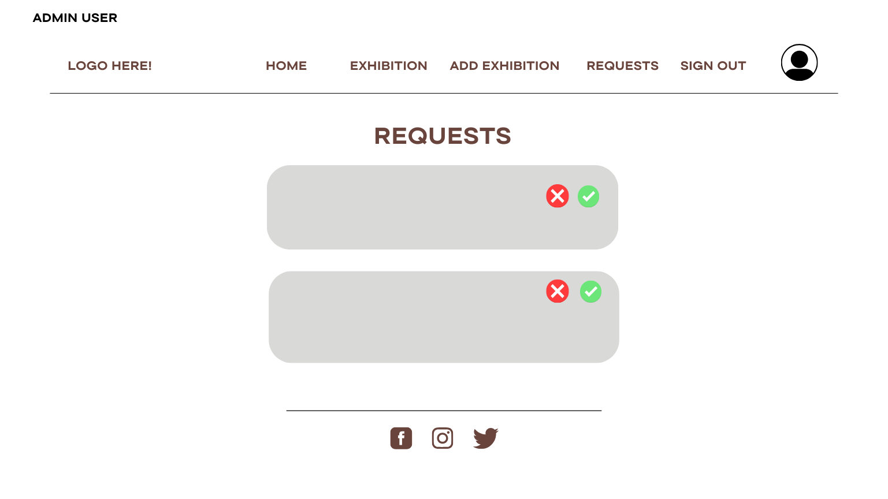 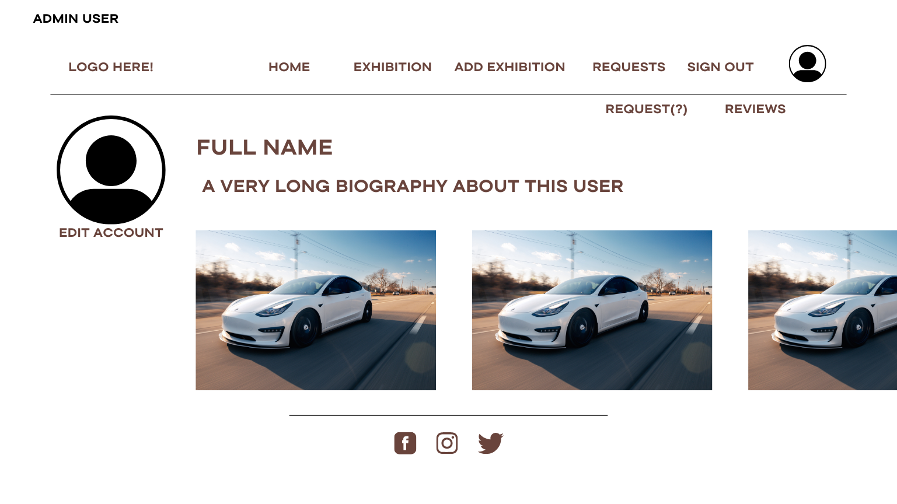

## Screenshots
           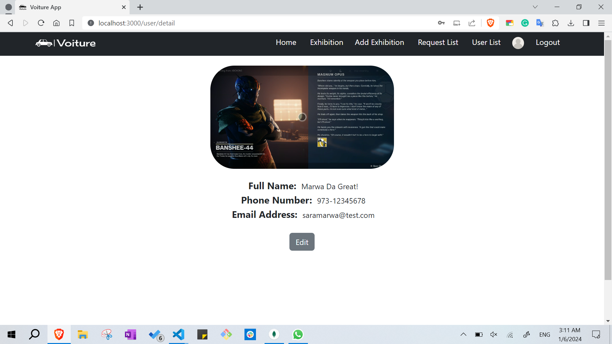   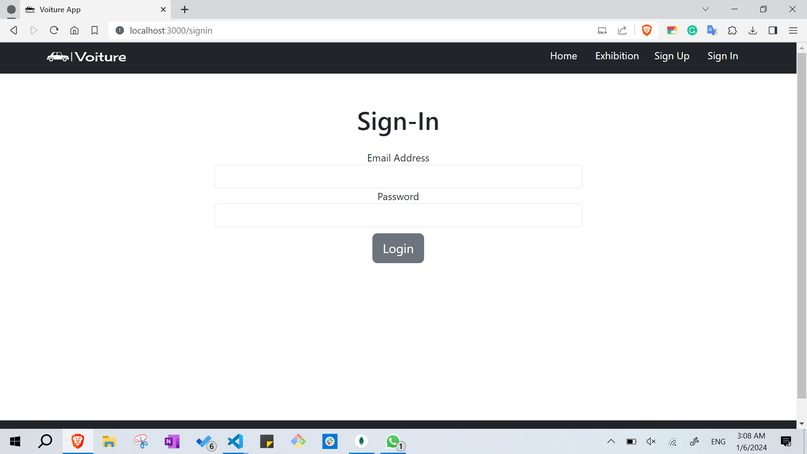 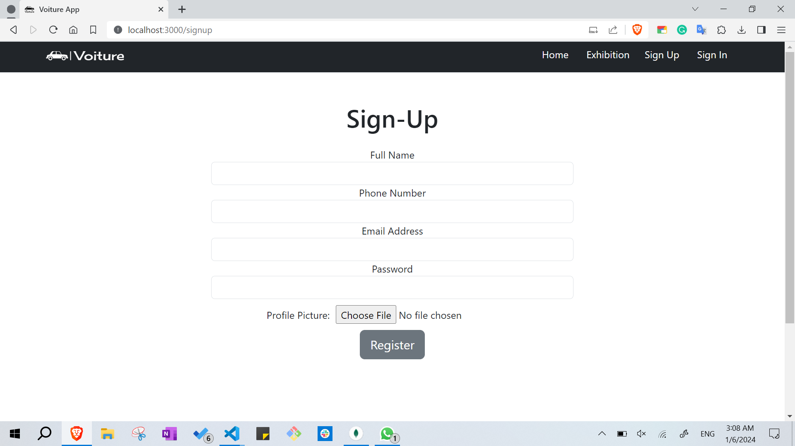   

## Technologies Used: List of the technologies used.
- React
- Axios
- Bootstrap
- jwt-decode
- Leaflet
- React-dom
- React-leaflet
- React-router-dom

## Getting Started
[Trello Board](https://trello.com/b/ebbHDNVj/project-3)

## Instructions for the Application : Front-End
- Cloning the front-end repository.
- Ensure the connection of the front-end and back-end by applying the Proxy in the package-json.
- Install the necessary packages and dependencies by running the command `npm init`.
- Execute the following command to run the front-end`npm start`.

## List of Unsolved Problems and Difficulties
- Logging out while in the profile page causes the app to lose the current user id, which displays an error.
- The exhibitions and cars can be edited and deleted by all Admins and SubAdmins.

## Future Enhancements of Voiture Application
- Prevent SubAdmins from editing or deleting exhibitions that does not belong to them.
- Prevent SubAdmins from editing or deleting cars that does not belong to their exhibitions.
- Allow users to delete their account.
- Allow users to edit their profile picture.
- Allow SubAdmins to edit their exhibition and cars pictures.
- Implement a feature for users to leave Reviews on their favorite car exhibitions.
- Integrate a rating system for the cars.
- Applying a Booking form for users to interact with the exhibition owners.
- Enhancing the application by inserting a search bar.
